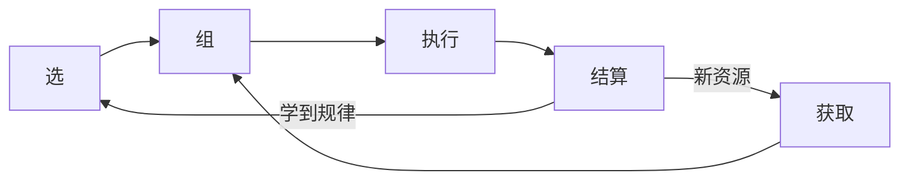
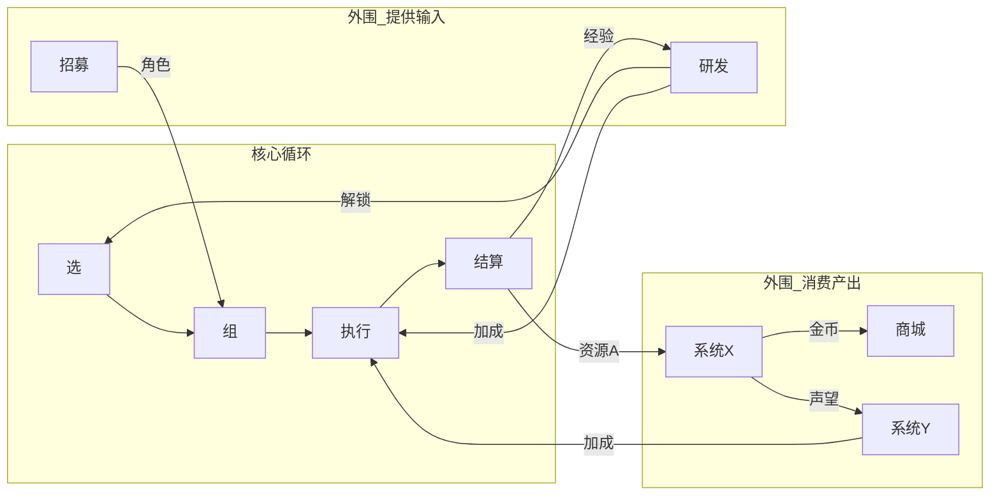
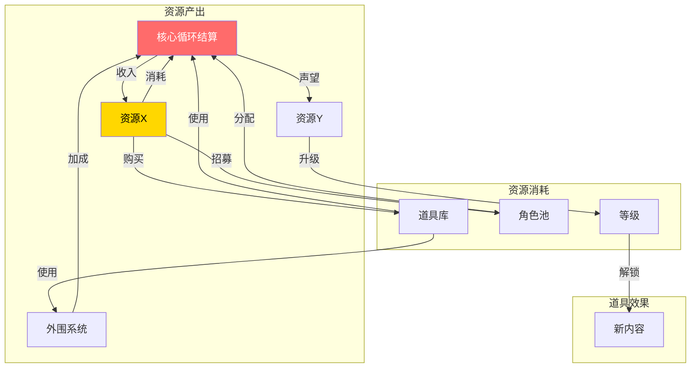

# 顶层设计示例

## 所属层级：第一层（顶层设计）

---

## 游戏是什么

**[游戏名]** — [一句话描述游戏类型和核心体验]

**给玩家什么体验**：
- 主驱动力：[发现/表达/积累/博弈]
- 副驱动力：[同上]

**玩家在游戏里的身份**：[初始身份] → [终极身份]

---

## 核心约束

核心约束是定义游戏身份边界的顶层边界——**它不是什么**和**它是什么**同样重要。

| 约束类型 | 内容 | 理由 |
|---------|------|------|
| **身份边界** | 它不是什么？ | 防止定位模糊，聚焦核心 |
| **玩家边界** | 目标用户是谁？不是谁？ | 确保设计不漂移 |
| **体验边界** | 这个游戏必须提供什么体验？绝不提供什么？ | 保持顶层一致性 |
| **循环边界** | 核心循环的最小闭环是什么？哪些是外围可以砍的？ | 优先级判断依据 |

**核心约束的作用**：当后续Phase中产生设计分歧时，用核心约束来裁决——符合约束的优先，不符合的放弃。

自问：这个游戏如果在 ___ 上妥协，它就不再是它了？

---

## 主要竞品参考

参考游戏是理解定位和类比的最直观方法。不是对比功能，而是对比**体验**和**核心循环结构**。

| 参考游戏 | 核心循环 | 主驱动力 | 与本游戏的本质差异 |
|---------|---------|---------|-----------------|
| [游戏A] | [核心动词流] | [发现/表达/积累/博弈] | [核心差异在哪] |
| [游戏B] | | | |
| [游戏C] | | | |

**用途**：
- 在后续 Phase 中遇到设计分歧时，用竞品来锚定体验预期
- 判断某个设计决策是否让游戏更像竞品（是好事还是坏事？）
- 理解竞品的生命周期，判断本游戏的可持续性

**自问**：
- 竞品A 解决的是哪类用户的什么需求？我们的目标用户有同样的需求吗？
- 我们想在哪个维度比竞品做得更深？哪个维度直接放弃竞争？

---

## 三个必须图

### 图1：核心循环图

核心循环：选 → 组 → 执行 → 结算 → 学规律 → 选（循环）

---

### 图2：完整循环图

---

### 图3：数值与道具流向图

---

## 顶层设计一页纸

| 维度 | 内容 |
|------|------|
| **游戏身份** | [初始] → [终极] |
| **核心循环** | 选 → 组 → 执行 → 结算 → 学规律 |
| **主驱动力** | [发现/表达/积累/博弈] |
| **副驱动力** | [同上] |
| **关键约束** | [平台/节奏/技术限制] |
| **差异化** | [与竞品的核心差异] |
