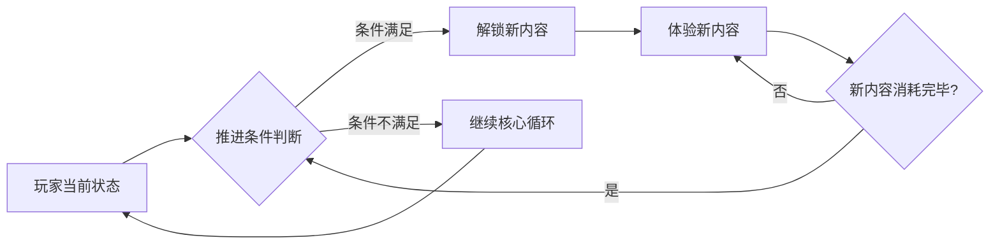
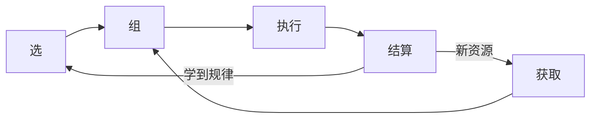
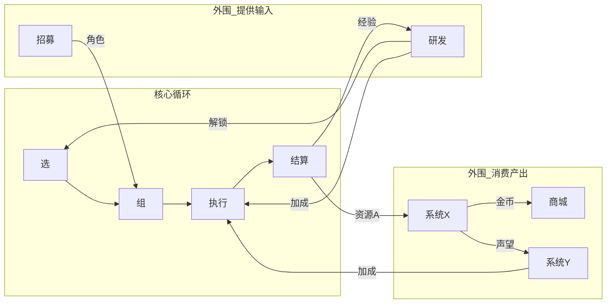
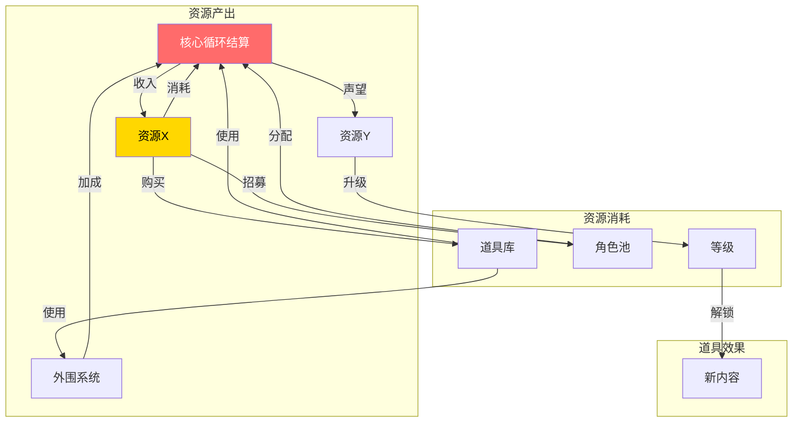

# 顶层设计示例

## 所属层级：第一层（顶层设计）

---

## 游戏是什么

**[游戏名]** — [一句话描述游戏类型和核心体验]

**给玩家什么体验**：
- 主驱动力：[发现/表达/积累/博弈]
- 副驱动力：[同上]

**玩家在游戏里的身份**：[初始身份] → [终极身份]

---

## 核心约束

核心约束是定义游戏身份边界的顶层边界——**它不是什么**和**它是什么**同样重要。

| 约束类型 | 内容 | 理由 |
|---------|------|------|
| **身份边界** | 它不是什么？ | 防止定位模糊，聚焦核心 |
| **玩家边界** | 目标用户是谁？不是谁？ | 确保设计不漂移 |
| **体验边界** | 这个游戏必须提供什么体验？绝不提供什么？ | 保持顶层一致性 |
| **循环边界** | 核心循环的最小闭环是什么？哪些是外围可以砍的？ | 优先级判断依据 |

**核心约束的作用**：当后续Phase中产生设计分歧时，用核心约束来裁决——符合约束的优先，不符合的放弃。

自问：这个游戏如果在 ___ 上妥协，它就不再是它了？

---

## 主要竞品参考

参考游戏是理解定位和类比的最直观方法。不是对比功能，而是对比**体验**和**核心循环结构**。

| 参考游戏 | 核心循环 | 主驱动力 | 与本游戏的本质差异 |
|---------|---------|---------|-----------------|
| [游戏A] | [核心动词流] | [发现/表达/积累/博弈] | [核心差异在哪] |
| [游戏B] | | | |
| [游戏C] | | | |

**用途**：
- 在后续 Phase 中遇到设计分歧时，用竞品来锚定体验预期
- 判断某个设计决策是否让游戏更像竞品（是好事还是坏事？）
- 理解竞品的生命周期，判断本游戏的可持续性

**自问**：
- 竞品A 解决的是哪类用户的什么需求？我们的目标用户有同样的需求吗？
- 我们想在哪个维度比竞品做得更深？哪个维度直接放弃竞争？

---

## 竞品有趣点提取

> 竞品的好设计是现成的灵感库。概念阶段不求分析透彻，但要把"好玩在哪"记录下来，留给 Phase 2 广度探索时作为变体原料使用。

| 竞品 | 有趣点 | 为什么有趣（一句话） | 可借鉴方向 |
|------|--------|-------------------|-----------|
| [竞品A] | [具体的设计点/机制/体验] | [哪个需求被满足了？] | [直接借鉴/变体借鉴/反向借鉴] |
| [竞品A] | [另一个有趣点] | | |
| [竞品B] | | | |

**提取原则**：
- 每个有趣点必须是**可观察的具体设计**，不是模糊评价
- 关注的是**为什么这个设计让玩家觉得好玩**，不是功能描述
- 有趣点不分大小——微交互的爽感和系统级的深度都可以记录
- 标注"可借鉴方向"是为了 Phase 2 分类：直接借鉴 / 变体借鉴 / 反向借鉴

**自问**：
- 这个有趣点满足的是哪类玩家的什么需求？我们的目标用户有同样需求吗？
- 这个有趣点依赖什么样的前提条件？我们有这些前提吗？
- 如果去掉这个有趣点，竞品还好玩吗？

**Phase 2 对接说明**：本节提取的所有有趣点，在 Phase 2 广度探索第一步（穷举系统级变体）时必须逐一审视——作为变体来源之一，纳入穷举范围。不是每个有趣点都要用，但每个都要被看到。

---

## 题材审视

题材不是皮肤，是核心体验的语义载体。题材选错了，所有系统设计都在空中盖楼。

### 题材与核心体验的契合度

| 审视维度 | 问题 | 判断 |
|---------|------|------|
| **语义支撑** | 这个题材天然能解释核心循环吗？还是需要硬凑？ | [高/中/低] |
| **行为合理性** | 玩家在题材内的行为（核心循环动词）在叙事上说得通吗？ | [合理/牵强/不合理] |
| **情感共鸣** | 目标用户对这个题材有天然好感吗？还是无感甚至排斥？ | [强/中/弱] |
| **内容承载** | 题材能自然产出多少种类的收集品/角色/场景？ | [丰富/一般/贫瘠] |
| **扩展空间** | DLC/续作能从这个题材自然延伸吗？ | [大/中/小] |

**自问**：
- 把核心循环的动词代入题材，读出来通顺吗？（"浣熊推币"vs"忍者推币"——哪个更自然？）
- 如果题材换成另一个，核心体验会变吗？如果不变，题材只是装饰，没有起到语义支撑作用。
- 这个题材在目标平台上有没有已经成功的先例？如果没有，是蓝海还是陷阱？

### 题材的市场认知度

| 维度 | 评估 |
|------|------|
| 目标用户对题材的熟悉度 | [高/中/低] — 玩家需要"学习"这个题材吗？ |
| 题材的市场饱和度 | [过热/适中/蓝海] — 同题材竞品多吗？ |
| 题材的文化风险 | [有/无] — 是否有文化敏感性、政治风险、版权隐患？ |
| 题材的视觉辨识度 | [高/中/低] — 一张截图能认出是什么题材吗？ |

**结论**：[题材名] 题材 [适合/勉强/不适合] 本游戏的核心体验，理由：___

---

## 画风审视

画风是玩家对游戏的第一判断，在玩法被理解之前，画风已经决定了"我要不要继续看"。

### 画风与题材/体验的一致性

| 审视维度 | 问题 | 判断 |
|---------|------|------|
| **题材匹配** | 这个画风能传达题材的核心气质吗？ | [匹配/部分匹配/冲突] |
| **体验支撑** | 画风强化了核心驱动力还是削弱了？（积累驱动需要"看到数字变大"的满足感，画风能提供吗？） | [强化/中性/削弱] |
| **情绪基调** | 画风传达的情绪和游戏想要的体验一致吗？（休闲=温暖明亮，恐怖=压抑黑暗） | [一致/偏离/冲突] |
| **辨识度** | 这个画风在一堆Steam缩略图里能一眼认出来吗？ | [高/中/低] |

### 画风的制作可行性

| 维度 | 评估 | 说明 |
|------|------|------|
| 团队能力匹配 | [匹配/需学习/不可行] | 当前团队能驾驭这个画风吗？ |
| 制作效率 | [高/中/低] | 这种画风产出内容的速度如何？（写实慢，卡通快；3D慢，2D快） |
| 资产复用度 | [高/中/低] | 同一套资产能支撑多少内容？（模块化程度） |
| DLC 扩展性 | [好/中/差] | 新内容能保持画风一致性吗？ |

### 画风的市场定位

| 维度 | 评估 |
|------|------|
| 目标用户的画风偏好 | [偏好/接受/排斥] |
| 同品类画风主流 | [主流/差异化/极端差异] — 差异化不一定是好事，可能意味着不接受 |
| 画风的"溢价感" | [高/中/低] — 这个画风看起来值多少钱？直接影响定价感知 |

**参考对标**：列出 2-3 个画风接近的游戏，说明借鉴什么、不借鉴什么。

| 参考游戏 | 借鉴 | 不借鉴 |
|---------|------|--------|
| [游戏A] | [具体元素] | [避免什么] |
| [游戏B] | | |

**结论**：[画风名] 画风 [适合/勉强/不适合] 本游戏，理由：___

---

## 核心内容推进形式

**这是回答"玩家怎么从一个阶段走到下一个阶段"的关键问题。** 推进形式决定了内容的消耗速度、复用价值和长线策略。

### 推进形式选择

| 形式 | 描述 | 适用场景 | 本游戏选择 |
|------|------|---------|-----------|
| **关卡制** | 线性/网状关卡序列，每关有明确的通关条件和星级 | 有清晰"过关"概念的游戏 | [是/否/部分] |
| **解锁制** | 通过积累资源/完成条件逐步解锁新内容（区域/角色/关卡） | 收集驱动、探索驱动 | [是/否/部分] |
| **无尽制** | 无终点，难度递增或内容随机生成 | Roguelike、高分挑战 | [是/否/部分] |
| **混合制** | 多种形式组合（如：主线解锁制 + 支线关卡制 + 无尽挑战模式） | 大多数中大型游戏 | [是/否/部分] |

**选择理由**：___

### 推进节奏设计

| 节奏参数 | 设计值 | 说明 |
|---------|--------|------|
| 新内容解锁间隔 | [X分钟/X小时/X次循环] | 玩家多久体验到一次新东西？ |
| 单个内容消耗时长 | [X分钟/X小时] | 一个新台面/关卡/区域能玩多久？ |
| 总内容量 | [X小时主线/X小时全收集] | 游戏有多少内容？ |
| 复用设计 | [无/轻度/深度] | 旧内容有重玩价值吗？（高分、稀有掉落、不同策略） |

### 推进中的内容门控

| 门控类型 | 描述 | 本游戏使用 |
|---------|------|-----------|
| **能力门控** | 需要特定能力/道具才能通过 | [使用/不使用] |
| **资源门控** | 需要积累足够资源 | [使用/不使用] |
| **收集门控** | 需要收集特定物品 | [使用/不使用] |
| **时间门控** | 需要等待/达到特定时长 | [使用/不使用] |
| **技巧门控** | 需要展现特定技巧 | [使用/不使用] |

**门控设计原则**：门控不能让玩家"卡住无聊"，要让玩家"差一点就到"——每次门控检查时都能看到明确的进度。

### 长线内容策略

| 策略 | 说明 |
|------|------|
| 主线内容量 | [X小时]，一次性消耗 |
| 复玩内容 | [描述]——旧内容为什么值得重玩？ |
| DLC 扩展计划 | [描述]——DLC扩展什么内容？扩展后总内容量？ |
| 用户生成内容 | [有/无]——是否支持玩家创作内容？ |

---

## 系统与子系统清单

> 顶层设计必须列出所有系统及其子系统，明确每个系统的职责边界。这是完整循环图和资源流图的锚点——图中的节点必须能对应到这张清单里的系统名。缺少这张清单 = 外围系统是拍脑袋挂上去的，没有经过推论。

### 核心系统（直接参与核心循环）

| 系统 | 子系统 | 解决什么体验问题 | 在循环中的角色 |
|------|--------|----------------|--------------|
| [系统A] | [子系统A1]、[子系统A2] | [一句话] | 消费核心产出 / 提供核心输入 |
| [系统B] | [子系统B1]、[子系统B2] | | |

### 外围系统（支撑/扩展核心循环）

| 系统 | 子系统 | 解决什么体验问题 | 与核心循环的关系 |
|------|--------|----------------|----------------|
| [系统X] | [子系统X1]、[子系统X2] | [一句话] | 产出→核心循环 / 核心循环→消耗 |
| [系统Y] | | | |

**自问**：
- 每个系统都能追溯到核心循环吗？追溯不到的系统是多余的还是遗漏了循环节点？
- 子系统的划分是否清晰到可以独立进入 Layer 3 设计？如果两个子系统纠缠在一起，说明划分粒度不对。

---

## 三个必须图

### 图1：核心循环图

核心循环：选 → 组 → 执行 → 结算 → 学规律 → 选（循环）

---

### 图2：完整循环图

---

### 图3：数值与道具流向图

---

## 顶层设计一页纸

| 维度 | 内容 |
|------|------|
| **游戏身份** | [初始] → [终极] |
| **核心循环** | 选 → 组 → 执行 → 结算 → 学规律 |
| **主驱动力** | [发现/表达/积累/博弈] |
| **副驱动力** | [同上] |
| **题材** | [题材名] — [一句话说明题材与核心体验的契合点] |
| **画风** | [画风名] — [一句话说明画风与题材/体验的一致性] |
| **内容推进** | [推进形式] — [一句话说明玩家如何从一个阶段走到下一个] |
| **关键约束** | [平台/节奏/技术限制] |
| **核心系统** | [系统A(子系统A1,A2)]、[系统B(子系统B1,B2)]... |
| **外围系统** | [系统X(子系统X1,X2)]、[系统Y]... |
| **差异化** | [与竞品的核心差异] |
