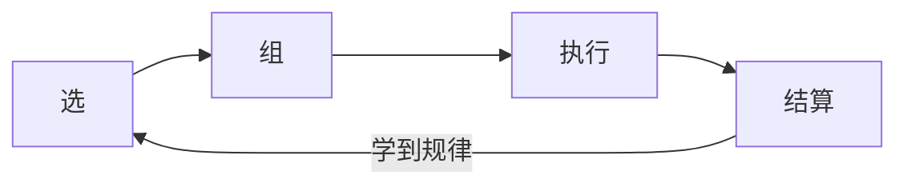

# design_doc.md 完整模板

> Phase 4 执行文档输出模板。完整版含所有检查项和产出标准。

```markdown
# [功能名] 设计文档

## 所属层级：第___层（顶层/系统架构/系统内部/功能设计）

---

## 设计目的
（解决什么用户的什么问题，不是做什么）
- 格式：解决___用户的___问题

## 顶层一致性
（这个设计支持顶层目标吗？支持哪个？偏离了哪个？）
> 自问：这个设计强化了哪个顶层体验，削弱了哪个？如果说不清楚，说明设计可能偏离了主线。

## 方案对比

| 方案 | 描述 | 优势 | 劣势 | 决策 |
|------|------|------|------|------|
| A（选定）| | | | |
| B | | | | |
| C | | | | |

**为什么选A不选B？** （必须回答）

## 详细设计

### 核心循环图

- 节点必须是具体动词（选择/分配/等待/消耗），不是名词
- 循环图必须回答：这个循环玩起来是什么感觉？

### 系统组成（第三层填写）
```
[系统名] = 子系统A + 子系统B + 子系统C
```

## 玩家可能怎么犯错
| 错误类型 | 最可能场景 | 设计回应 | 严重程度 |
|---------|-----------|---------|---------|
| 运动控制错误 | | | 轻微/中等/重大/严重 |
| 流程错误 | | | |
| 遗漏错误 | | | |
| 错误行动 | | | |

## 核心风险
| 风险 | 严重程度 | 应对 |
|------|---------|------|
| | 高/中/低 | |
| | | |

**不是避而不谈**：坦诚说清楚可能的最坏情况，以及打算如何应对。

## 验证方式
| 验证类型 | 验证内容 | 上线指标 |
|---------|---------|---------|
| 一次性测试 | 首次印象 | |
| 黑盒测试 | 自然行为 vs 设计意图 | |
| 白盒测试 | Bug 和逻辑错误 | |

## 上线计划
| 阶段 | 内容 | 验证问题 |
|------|------|---------|
| P0（最小可玩）| | |
| P1（完整版）| | |
```

---

## 模板各节说明

### 设计目的
"为什么做，比做什么重要"。解决什么问题，不是做什么功能。

### 核心循环图
必须用 Mermaid flowchart LR。节点必须是动词（选择/分配/等待/消耗），不是名词。循环图必须回答"这个循环玩起来是什么感觉"。

### 方案对比
**必须有多个方案对比**，不能只有一个方案。核心问题是：为什么选A不选B？

### 玩家可能怎么犯错
四类错误 + 严重程度响应矩阵：

| 严重程度 | 响应 |
|----------|------|
| 轻微 | 微妙的视觉/音频暗示 |
| 中等 | 清晰反馈，轻松恢复 |
| 重大 | 明确指导，最小惩罚 |
| 严重 | 自动保存/检查点/撤销 |

### 验证方式
一次性测试（首次印象）/ 黑盒测试（自然行为 vs 设计意图）/ 白盒测试（Bug和逻辑错误）。

### 上线计划
分 P0 最小可玩和 P1 完整版，每阶段有明确的验证问题。
> 验证问题格式：在这个阶段，我需要回答什么问题，才知道设计成功了？
